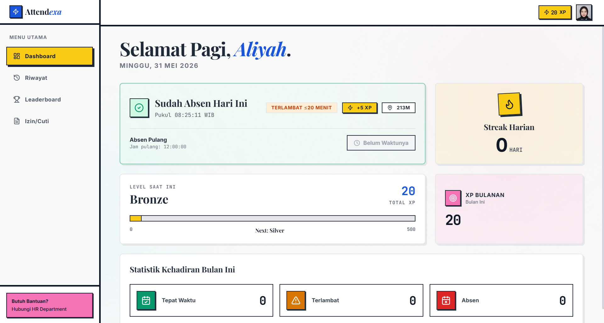
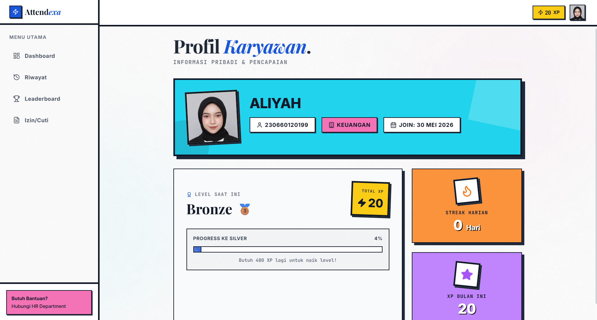
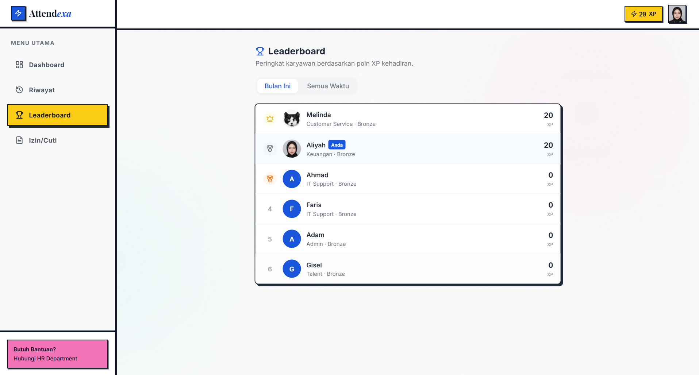

# Attendexa - Sistem Absensi dengan Gamifikasi

Attendexa adalah platform absensi digital berbasis web dengan gaya Neo-Brutalist Light Mode. Aplikasi ini menggabungkan fitur absensi berbasis lokasi GPS dan verifikasi wajah (Face Recognition via kamera) dengan sistem gamifikasi leaderboard XP yang mendorong kedisiplinan karyawan secara organik.

## Tech Stack
- React 19 + TypeScript
- Vite 6
- Tailwind CSS (Neo-Brutalist Design)
- Supabase (Auth, Database, Storage)

## Fitur Utama
- **Absensi Berbasis Lokasi & Foto**: Memastikan karyawan berada di area kantor saat melakukan absensi.
- **Gamifikasi & XP**: Memberikan poin XP untuk kehadiran tepat waktu dan streak harian.
- **Leaderboard**: Papan peringkat bulanan untuk memotivasi karyawan.
- **Dashboard Karyawan**: Ringkasan kehadiran dan level XP.

## Preview

<p align="center">
  
</p>

<br>

<p align="center">
  
  
</p>

## Setup Lokal

1. Clone repositori ini
2. Install dependencies:
   ```bash
   npm install
   ```
3. Copy file `.env.example` ke `.env` dan isi variabel Supabase:
   ```bash
   VITE_SUPABASE_URL=your_supabase_url
   VITE_SUPABASE_ANON_KEY=your_supabase_anon_key
   ```
4. Jalankan development server:
   ```bash
   npm run dev
   ```
